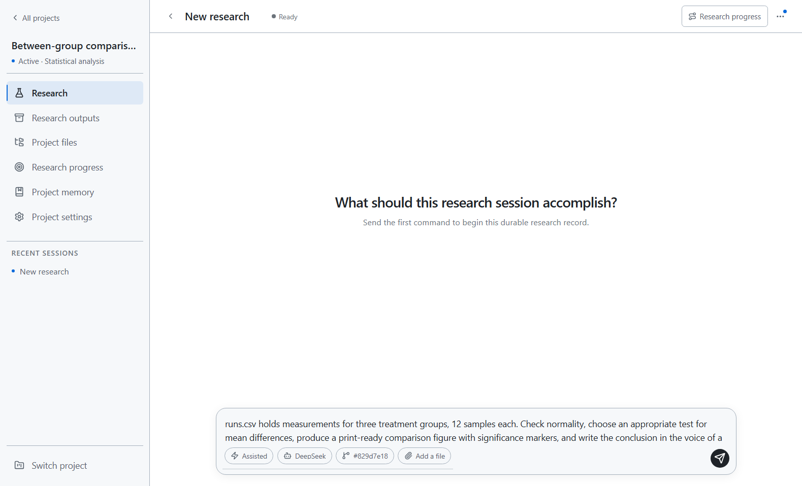
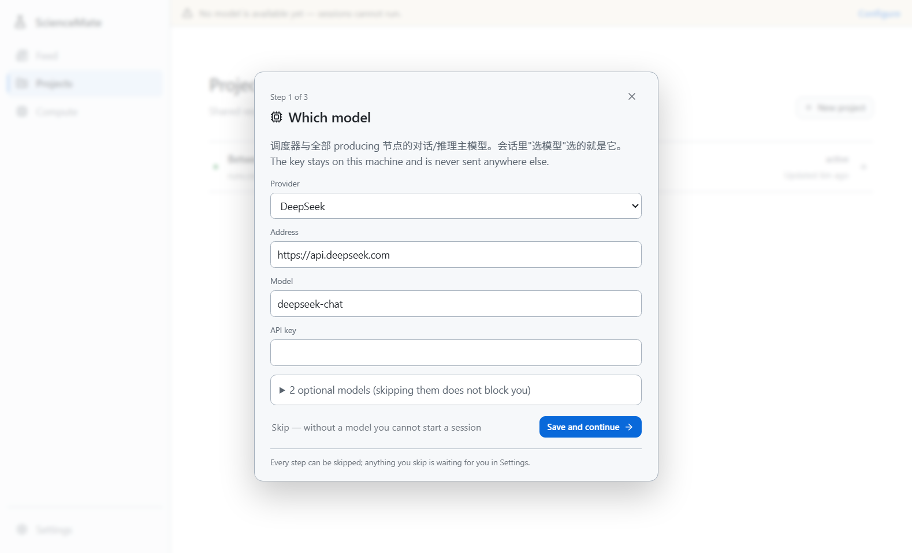
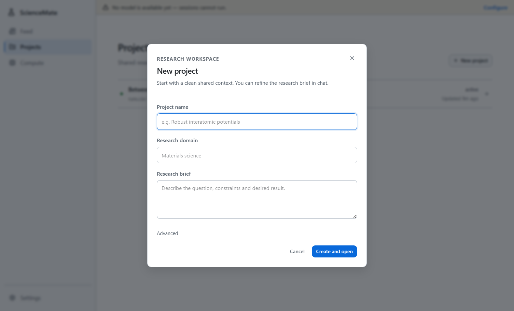

# ScienceMate (Agent for Science) — Research Platform

English | [简体中文](README.zh-CN.md)

Install it, open it, and say what you want to research — it writes the code, runs the computation, reads the results, and writes the paper.

Data and computation stay **on your own machine**: every project is a local git repository, and model keys are stored encrypted on that machine only. Python, git, LaTeX (tectonic), and a bash shell for running experiments ship with the app — **nothing to set up first**.

- Current version: [v0.5.6](../../releases/tag/v0.5.6) · [Download for macOS](https://github.com/IdeaHorizon/sciencemate/releases/download/v0.5.6/ScienceMate-0.5.6-arm64.dmg) · [Download for Windows](https://github.com/IdeaHorizon/sciencemate/releases/download/v0.5.6/ScienceMate-Setup.exe) · changelog in [Releases](../../releases)
- This repository holds the **source code** of the Personal edition and its **releases** (installers and updates). The installers are built from this tree; see [DEVELOPMENT.md](DEVELOPMENT.md) to run it from source.
- This is the **Personal edition**: everything runs on your own machine. The Professional edition adds a shared organization server for teams and is not distributed here.

## A look at the interface

Open a research session inside a project and say what you need in the input box — model, collaboration mode, and files are all attached right next to it:



---

## What it does

- **One sentence in, a study out** — code, computation, results, and a written paper, all on your own machine
- **Projects are git repositories** — one local repo per project; git is the record of what changed and when
- **Research intelligence built in** — follow fields, journals, and scholars; the feed uses them to pick what is worth your time; literature search in English and Chinese
- **Figures** — charts are laid out to a print type area, and the type area decides the canvas; data plots follow a design contract
- **Experiment nodes** — experiment orchestration with run contracts and output postconditions

## Install

### Download the installer

| Platform | Download | Size |
|---|---|---|
| macOS (Apple Silicon) | [ScienceMate-0.5.6-arm64.dmg](https://github.com/IdeaHorizon/sciencemate/releases/download/v0.5.6/ScienceMate-0.5.6-arm64.dmg) | 342 MB |
| Windows 10 / 11 (64-bit) | [ScienceMate-Setup.exe](https://github.com/IdeaHorizon/sciencemate/releases/download/v0.5.6/ScienceMate-Setup.exe) | 394 MB |

Checksums: [SHA256SUMS](https://github.com/IdeaHorizon/sciencemate/releases/download/v0.5.6/SHA256SUMS) · all files: [Releases](../../releases/latest)

- **macOS**: open the dmg and drag ScienceMate into Applications. The first launch is blocked once because the app is not yet signed: **System Settings → Privacy & Security → scroll down → "Open Anyway"**, then confirm. One time per machine.
- **Windows**: run `ScienceMate-Setup.exe`. If SmartScreen shows "Windows protected your PC", click **More info → Run anyway**. One time per machine.

### Or install with one command

#### macOS (Apple Silicon)

One command:

```sh
curl -fsSL https://raw.githubusercontent.com/IdeaHorizon/sciencemate/main/install.sh | sh
```

The app opens itself when the install finishes. **No "unidentified developer" prompt** — Gatekeeper only inspects files carrying the quarantine mark, and that mark is added by browsers when saving files. `curl` doesn't add it.

<details>
<summary>See what the script does first, or install manually</summary>

The script does five things: download the dmg → verify against `SHA256SUMS` → mount → copy into Applications → open. It stops on any failure.

Read before you run:

```sh
curl -fsSL https://raw.githubusercontent.com/IdeaHorizon/sciencemate/main/install.sh -o install.sh
less install.sh
sh install.sh
```

Just show what it would do, touch nothing: `AFS_DRY_RUN=1 sh install.sh`

You can also download the `.dmg` from [Releases](../../releases) and drag it into Applications. If you download through a browser, the system blocks the first launch (the app has no signing certificate yet): **System Settings → Privacy & Security → scroll down → "Open Anyway" → confirm once more**. One time per machine.

</details>

#### Windows (10 / 11, 64-bit)

One command (PowerShell):

```powershell
irm https://raw.githubusercontent.com/IdeaHorizon/sciencemate/main/install.ps1 | iex
```

The app opens itself when the install finishes. **No "Windows protected your PC" prompt** — SmartScreen only blocks files carrying the mark-of-the-web, and that mark is added by browsers when saving files. `irm` doesn't add it.

Double-clicking the installer gives you a wizard with three questions: where to install (default shown on screen, editable, with a "Browse…" button), a desktop shortcut, and a Start-menu entry. The Start menu gets an uninstall shortcut, so does "Apps & features", and your data is kept by default. **Paths with Chinese characters work, and no administrator rights are needed** (everything installs into your own user profile).

<details>
<summary>See what the script does first, or install unattended</summary>

The script does four things: download `Setup.exe` → verify against `SHA256SUMS` → remove the mark-of-the-web → run the installer. It stops on any failure.

Read before you run:

```powershell
irm https://raw.githubusercontent.com/IdeaHorizon/sciencemate/main/install.ps1 -OutFile install.ps1
notepad install.ps1
.\install.ps1
```

Environment variables (`irm | iex` cannot take parameters, so configuration goes through env vars):

```powershell
$env:AFS_SILENT=1        # unattended: no wizard, no launch after install; shortcuts still created
$env:AFS_NO_LAUNCH=1     # install without launching
$env:AFS_DRY_RUN=1       # print what it would do, do nothing
$env:AFS_INSTALL_DIR="D:\Tools\ScienceMate"   # where to install
.\install.ps1
```

</details>

> The app is a self-contained window — double-click the icon and go. The backend starts and stops with the app; closing the window is the exit.

## Quick start

On first launch it asks three things. Every step can be skipped, and anything you skip is waiting for you in Settings:

1. **Which model** — pick a provider, address, and API key. The key is stored encrypted on this machine and never sent anywhere else.
2. **Which fields you follow** — a few research directions; the feed uses them to choose what is worth your time today.
3. **What to open first** — the page the app lands on each time you open it.



Then walk through a real task. Say you have experiment data you want to understand:

**① Create a project**, give it a name, and drop your data file (say `runs.csv`) into it — a local git repository is created for the project.



**② Say what you want in the input box**, for example:

> `runs.csv` holds measurements for three treatment groups, 12 samples each. Check normality, choose an appropriate test for mean differences, produce a print-ready comparison figure with significance markers, and write the conclusion in the voice of a Results section — two or three sentences.

**③ It takes over**: writes the code, runs the computation, reads the results, and hands you the figure and the analysis — every step committed to the project's git repository, always reviewable with `git log`.

**④ Keep talking if it's not right**: different colors, different size, a different test, one more control group — iterate inside the same project.

That's the whole pitch: **say what you want to research, and it does the rest.**

## Updates

The app checks for new versions by itself; when one exists you'll see a line in the UI — "new version · update now". Click it and the app downloads, verifies the signature, and restarts. **Updates only replace the program; your project data is never touched.**

An in-app update replaces the platform code and the interface. Some releases also change parts it cannot replace — the bundled Python, the TeX engine, or the window itself. When that happens the app says so and points you to the installer; installing over the old copy keeps your projects and settings.

Settings → About shows the current version and update source, and can check for updates manually.

## Working with a team

This edition runs on your machine only. Shared organization servers, accounts, and invitations are part of the Professional edition.

## Where your things live

**macOS**

```
~/.harness-framework/
  db.sqlite            settings and index (readable by you only)
  project-worktrees/   one git repository per project
  logs/backend.log     look here when something breaks
```

**Windows**

```
%LOCALAPPDATA%\afs\                    data (same three items)
%LOCALAPPDATA%\Programs\ScienceMate\   the app itself
```

Uninstall = drag the app from Applications to the Trash on macOS; on Windows use the Start-menu uninstall entry, or delete the `%LOCALAPPDATA%\Programs\ScienceMate` folder. Data stays in the data directory on both platforms — deleting it is up to you.

## System requirements

|  | macOS | Windows |
|---|---|---|
| Version | 13 or newer, Apple Silicon (M series) | 10 / 11, 64-bit |
| Disk | about 1.5 GB | about 1 GB (915 MB installed) |
| Privileges | standard user | standard user, **no administrator** |

Both platforms need a working model API key.

## Security & signatures

- The install scripts verify every download against the release's `SHA256SUMS`; a mismatch aborts the install.
- Update payloads carry an ed25519 signature (`manifest.json.sig`); anything that doesn't verify is rejected.
- Installers are **not code-signed**: installers downloaded through a browser get stopped once by SmartScreen / Gatekeeper (see the install section above for the one-time unblock); installs via the scripts raise no prompt.

## Troubleshooting

1. Read the last few dozen lines of the log:
   - macOS: `~/.harness-framework/logs/backend.log`
   - Windows: `%LOCALAPPDATA%\afs\logs\backend.log`
2. Run the self-check:

   macOS

   ```sh
   "/Applications/ScienceMate.app/Contents/Resources/python/bin/python3" -m app.launcher doctor
   ```

   Windows

   ```powershell
   cd $env:LOCALAPPDATA\Programs\ScienceMate
   & ".\Resources\python\python.exe" -B -m app.launcher doctor
   ```

   It prints where the data root, UI, harness, git, model shell, PDF engine, and sandbox live — whichever line says `not found` is your culprit.
3. Still stuck? Paste both into a [new issue](../../issues/new) and send it over.

---

*Preview release. Licensing and third-party notices are being finalised before the public release.*
