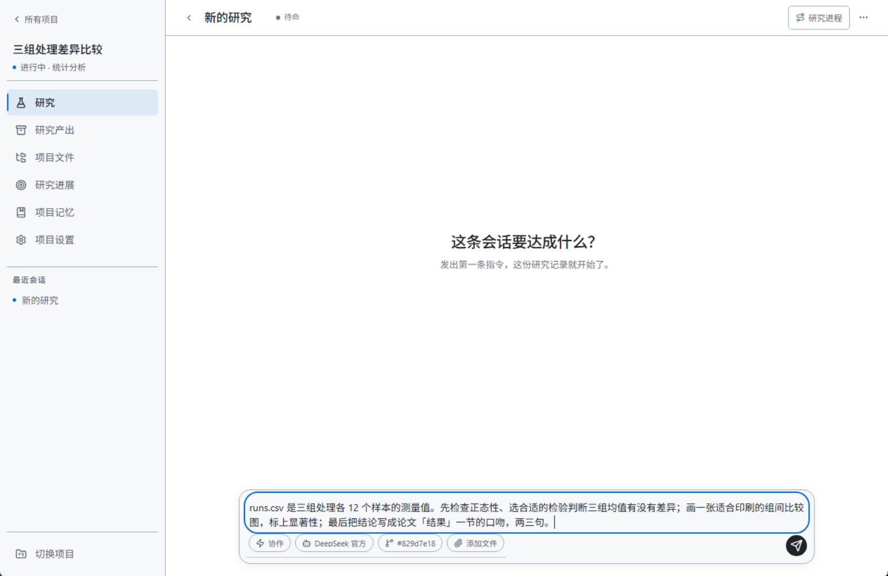
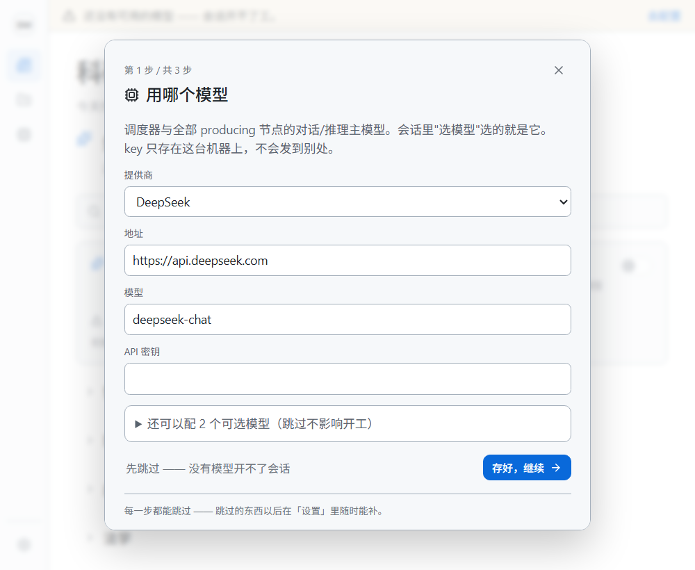
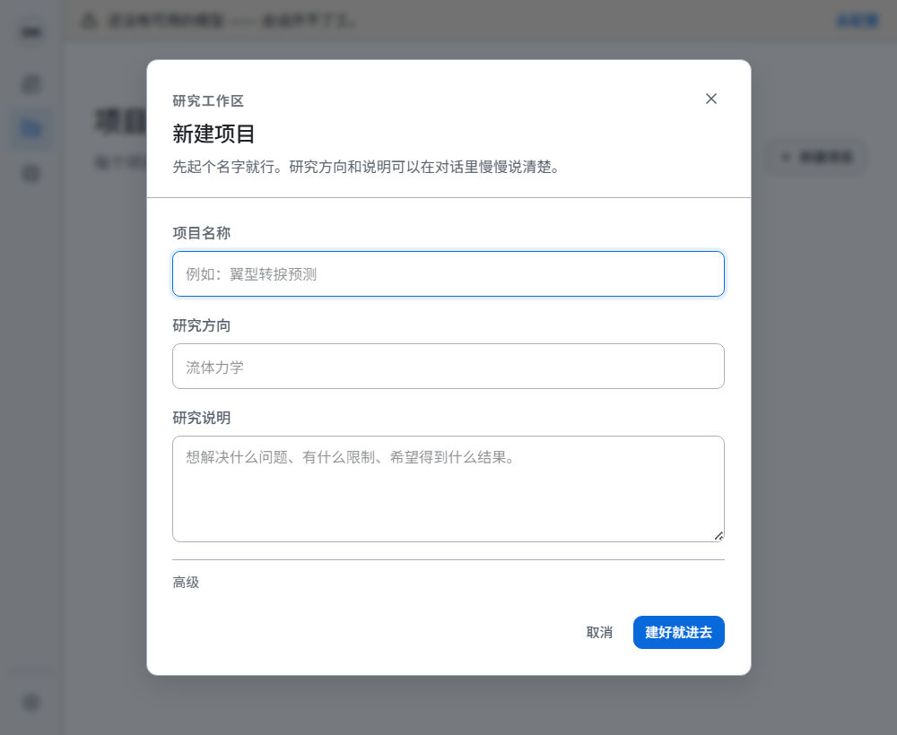

# ScienceMate（Agent for Science）科研平台

[English](README.md) | 简体中文

装上、打开、说一句你想研究什么 —— 它自己写代码、跑计算、看结果、出论文。

数据和计算都在**你自己的机器上**：项目是本地 git 仓库，模型 key 加密后只存在本机。
Python、git、LaTeX（tectonic）、跑实验用的 bash 都随包带，**不用先装任何东西**。

- 当前版本：[v0.5.4](../../releases/tag/v0.5.4) · 更新日志见 [Releases](../../releases)
- 本仓库是**发布件仓库**（安装包与更新），不含源码
- 这是**个人版**：全部在你自己的机器上运行。团队共用的组织服务器属于专业版，不在这里发布。

## 界面一览

打开项目里的一条研究会话，在输入框里说清你要什么 —— 模型、协作方式、文件都挂在输入框旁边：



---

## 它能做什么

- **说一句话，跑一个研究** —— 写代码、跑计算、看结果、写论文，全程在你自己的机器上进行
- **项目即 git 仓库** —— 每个项目一个本地 git 仓库，改了什么、什么时候改的，git 说了算
- **自带科研情报** —— 订阅学科 / 期刊 / 学者，资讯页按它们挑今天值得看的；文献检索支持中英文
- **出图** —— 图表按印刷版心出图，版心决定画布；数据图有设计规范
- **实验节点** —— 带运行合同与输出后置条件的实验编排

## 安装

### macOS（Apple Silicon）

一条命令：

```sh
curl -fsSL https://raw.githubusercontent.com/IdeaHorizon/sciencemate/main/install.sh | sh
```

装完会自己打开。**不会弹「无法验证开发者」** —— Gatekeeper 只查带隔离标记的文件，那个标记是浏览器保存文件时打上去的，`curl` 不打。

<details>
<summary>想先看脚本做什么，或者手动装</summary>

脚本只做五件事：下载 dmg → 用 `SHA256SUMS` 核对 → 挂载 → 复制进「应用程序」→ 打开。任何一步失败就停。

先看再跑：

```sh
curl -fsSL https://raw.githubusercontent.com/IdeaHorizon/sciencemate/main/install.sh -o install.sh
less install.sh
sh install.sh
```

只想看它打算做什么、先不动手：`AFS_DRY_RUN=1 sh install.sh`

也可以从 [Releases](../../releases) 直接下 `.dmg` 拖进「应用程序」。走浏览器下载的话，第一次打开会被系统拦（应用还没买签名证书）：**系统设置 → 隐私与安全性 → 拉到最下面「仍要打开」→ 再确认一次**。每台机器只需要这一次。

</details>

### Windows（10 / 11，64 位）

一条命令（PowerShell）：

```powershell
irm https://raw.githubusercontent.com/IdeaHorizon/sciencemate/main/install.ps1 | iex
```

装完会自己打开。**不会弹「Windows 已保护你的电脑」** —— SmartScreen 只拦带「网络来源标记」的文件，那个标记是浏览器保存文件时打上去的，`irm` 不打。

双击安装器的话是一个向导：问三件事 —— 装到哪（默认位置写在脸上、可以改、有「浏览…」）、要不要桌面图标、要不要加到开始菜单。开始菜单里有卸载入口，「应用和功能」里也有一条，默认不删你的数据。**中文路径能用，不需要管理员权限**（装在你自己的用户目录下）。

<details>
<summary>想先看脚本做什么，或者无人值守安装</summary>

脚本只做四件事：下载 `Setup.exe` → 用 `SHA256SUMS` 核对 → 去掉网络来源标记 → 运行安装器。任何一步失败就停。

先看再跑：

```powershell
irm https://raw.githubusercontent.com/IdeaHorizon/sciencemate/main/install.ps1 -OutFile install.ps1
notepad install.ps1
.\install.ps1
```

环境变量（`irm | iex` 传不了参数，配置走环境变量）：

```powershell
$env:AFS_SILENT=1        # 无人值守：不弹向导、装完不启动，快捷方式照建
$env:AFS_NO_LAUNCH=1     # 只装不启动
$env:AFS_DRY_RUN=1       # 只说要做什么，不做
$env:AFS_INSTALL_DIR="D:\Tools\ScienceMate"   # 装到哪
.\install.ps1
```

</details>

> 应用是内嵌窗口，双击图标直接用；后端随应用一起起、一起停，关窗口就是退出。

## 快速开始

打开后它先问三件事。每一步都能跳过，跳过的以后在「设置」里随时能补：

1. **用哪个模型** —— 填提供商、地址、API key。key 加密后存在这台机器上，不发去别处。
2. **你关心哪些方向** —— 挑几个研究方向，资讯页就按它们给你挑今天值得看的。
3. **打开时先看什么** —— 每次打开这个应用先落在哪一页。



然后拿一个真实任务走一遍。假设你有一份实验数据想弄清楚：

**① 新建项目**，起个名字，把数据文件（比如 `runs.csv`）放进项目 —— 它在本机建一个 git 仓库。



**② 在输入框里说你要什么**，比如说：

> `runs.csv` 是三组处理各 12 个样本的测量值。先检查正态性、选合适的检验判断三组均值有没有差异；画一张适合印刷的组间比较图，标上显著性；最后把结论写成论文「结果」一节的口吻，两三句。

**③ 它接手**：自己写代码、跑计算、看结果，把图和分析结论交给你 —— 每一步都提交在项目的 git 仓库里，`git log` 随时可查。

**④ 不满意就继续说**：改配色、改尺寸、换检验方法、补一组对照，同一个项目里接着改。

就这一句话的事：**说一句你想研究什么，剩下的它来。**

## 更新

应用自己会看有没有新版本，有就在界面上出一行「有新版本 · 现在更新」。点一下，它下载、校验签名、重启自己。**更新只换程序，不碰你的项目数据。**

应用内更新换的是平台代码和界面。有些版本还改了它换不了的部分 —— 随包的 Python、排版器，或者窗口本身。遇到这种版本应用会直说，并告诉你去哪下安装包；用新安装包覆盖安装，项目和设置都保留。

设置里的「关于」可以看到当前版本和更新源，也能手动查更新。

## 多人协作

这一版只在你自己的机器上运行。共用的组织服务器、账号与邀请属于专业版。

## 你的东西放在哪

**macOS**

```
~/.harness-framework/
  db.sqlite            设置与索引（仅本人可读）
  project-worktrees/   每个项目一个 git 仓库
  logs/backend.log     出问题时看这里
```

**Windows**

```
%LOCALAPPDATA%\afs\                     数据（同上三样）
%LOCALAPPDATA%\Programs\ScienceMate\    程序本体
```

卸载 = macOS 把「应用程序」里的图标扔进废纸篓；Windows 用开始菜单里的卸载入口，或删掉 `%LOCALAPPDATA%\Programs\ScienceMate` 整个目录。两边数据都留在上面那个数据目录，你自己决定要不要删。

## 系统要求

|  | macOS | Windows |
|---|---|---|
| 版本 | 13 或更新，Apple Silicon（M 系列） | 10 / 11，64 位 |
| 磁盘 | 约 1.5 GB | 约 1 GB（装完 915 MB） |
| 权限 | 普通用户 | 普通用户，**不用管理员** |

两边都要一个能用的模型 API key。

## 安全与签名

- 安装脚本下载后会用发布目录里的 `SHA256SUMS` 核对，对不上就不装。
- 更新载荷带 ed25519 签名（`manifest.json.sig`），签名对不上一律拒收。
- 安装包**未做代码签名**：从浏览器直接下载的安装包，第一次运行会被 SmartScreen / Gatekeeper 拦一道（放行步骤见上面安装一节）；走脚本安装不会弹。

## 出问题了

1. 看日志最后几十行：
   - macOS：`~/.harness-framework/logs/backend.log`
   - Windows：`%LOCALAPPDATA%\afs\logs\backend.log`
2. 跑应用自检：

   macOS

   ```sh
   "/Applications/ScienceMate.app/Contents/Resources/python/bin/python3" -m app.launcher doctor
   ```

   Windows

   ```powershell
   cd $env:LOCALAPPDATA\Programs\ScienceMate
   & ".\Resources\python\python.exe" -B -m app.launcher doctor
   ```

   它会印出数据根、界面、harness、git、模型 shell、PDF 引擎、沙箱各在哪 —— 有一项是 `not found` 就是它。
3. 还是不行，把上面两样贴到 [Issue](../../issues/new) 里发给我们。

---

*预览版。本仓库只发安装包与更新，不含源码。*
